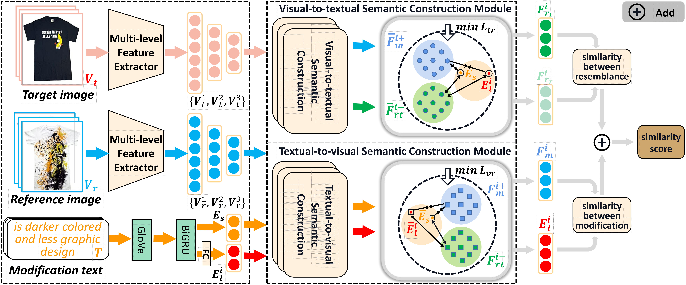
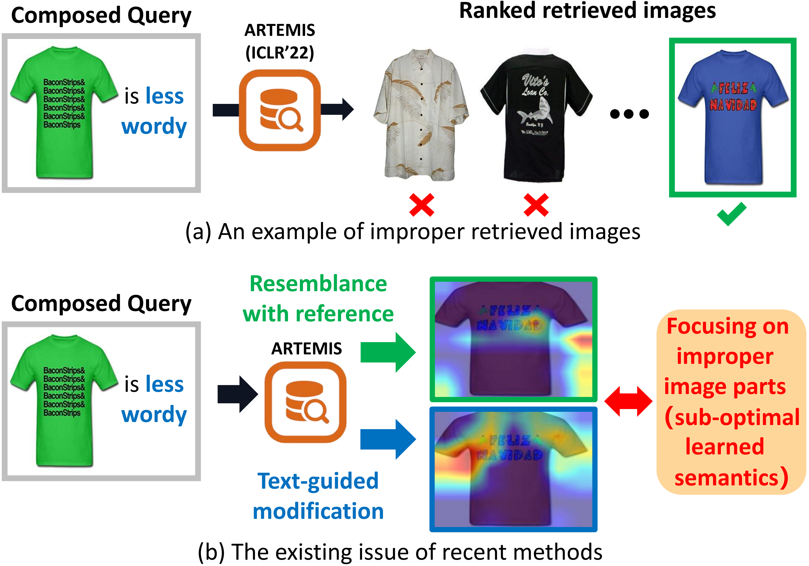
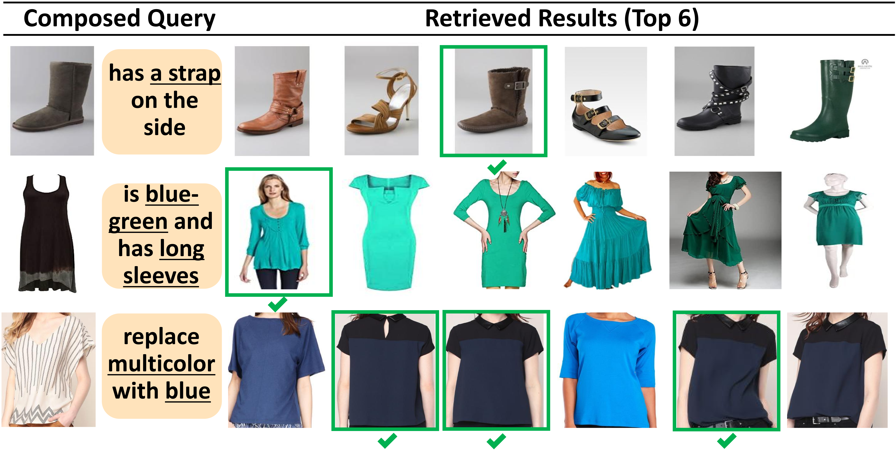
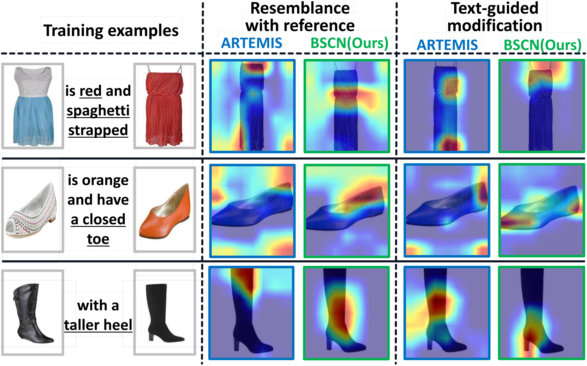

## Introduction
This is the source code of "Bidirectional Semantic Construction Network for Composed Query-Based Image Retrieval", more analysis can be refer to https://github.com/anonymoustnt/anony/blob/main/supp.pdf.

## Bidirectional Semantic Construction Network for Composed Query-Based Image Retrieval
The proposed BSCN is a novel method that leverages the proposed bidirectional semantic construction to refine the semantics from multi-level feature extraction at the textual and visual levels.

## Proposed Model (BSCN)
* Multi-Level Feature Extraction
* Visual-to-Textual Semantic Construction
* Textual-to-Visual Semantic Construction
* Objective Function

## Motivation

(a) An incorrect retrieved example of the state-of-the-art ARTEMIS. (b) The semantics of resemblance with reference and text-guided modification obtained from ARTEMIS are sub-optimal, i.e., focusing on improper image parts.

## Retrieval Examples

## Visualization  Examples

## Data Download
The three datasets (FashionIQ, Shoes, Fashion200k) can be downloaded from the official code release for ARTEMIS (ICLR 2022).
## Usage
* Run vocab.py to compute the corresponding vocabulary
* Run train.py (img_finetune, default=False; txt_finetune, default=False)
* Run train.py (img_finetune, default=False; txt_finetune, default=False)
* Run evaluate.py to evaluate the R@K of the model
